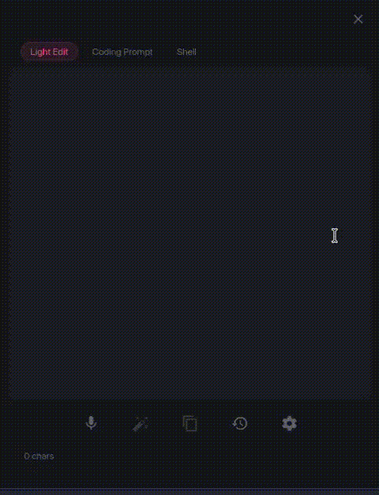

# Arai

[](https://github.com/mattkoltun/arai/actions/workflows/rust.yml)
[](https://github.com/mattkoltun/arai/actions/workflows/release.yml)


Arai is a voice-first prompt and writing assistant built for power users who want to speed up their workflows. It captures microphone audio, transcribes it locally via Whisper, then transforms the text through OpenAI's API. The result is polished text ready for use in agent prompts, emails, messages, and more.



## Installation

### From GitHub Releases

Download the latest release from the [Releases](https://github.com/mattkoltun/arai/releases) page. On macOS, drag `Arai.app` to your Applications folder.

### From Source

Requires the [Rust toolchain](https://rustup.rs/) (stable) and the [CMAKE](https://cmake.org/download/)

```bash
git clone https://github.com/mattkoltun/arai.git
cd arai
cargo install --path .
```

## Development

For building, running, testing, and local setup instructions, see [DEVELOPMENT.md](./DEVELOPMENT.md).

## Configuration

Config file location: `~/.config/arai/config.yaml`

Example:

```yaml
log_level: debug
log_path: /tmp/arai.log
global_hotkey: Alt+Space
input_device: MacBook Pro Microphone
theme_mode: dark
agent_prompts:
  - name: editor
    instruction: Rewrite the user text for clarity and brevity while preserving meaning.
  - name: agent prompt
    instruction: >-
      Rewrite the user text as a structured prompt for an autonomous coding agent.
      Use a "Motivation" section explaining why the change is needed, followed by
      a "Requirements" section with a numbered list of concrete, actionable items.
      Be precise and unambiguous. Do not include conversational filler.
  - name: shell command
    instruction: >-
      Convert the user text into a single shell command or short pipeline that
      accomplishes what was described. Output only the command, with no explanation
      or surrounding text. It should be ready to copy and paste into a terminal.
default_prompt: 0
transcriber:
  model_path: ~/.local/share/arai/models/ggml-small.en.bin
  window_seconds: 3.0
  overlap_seconds: 0.25
  silence_threshold: 0.003
  use_gpu: true
  flash_attn: true
  no_timestamps: true
```

### Config Parameters

| Parameter | Default | Description |
|---|---|---|
| `log_level` | `debug` | Log verbosity. One of: `trace`, `debug`, `info`, `warn`, `error`, `off`. |
| `log_path` | `~/Library/Logs/arai.log` (macOS) | Path to the log file. |
| `global_hotkey` | `Alt+Space` | System-wide hotkey to toggle listening. Uses [global-hotkey](https://docs.rs/global-hotkey) syntax (e.g. `Alt+Space`, `CmdOrCtrl+Shift+A`). |
| `default_prompt` | `0` | Index of the active agent prompt (zero-based). |
| `input_device` | System default | Name of the audio input device. Set this to avoid Bluetooth headphones switching from A2DP (stereo) to HFP (mono) when the mic activates. |
| `theme_mode` | `dark` | Color scheme. One of: `dark` (Catppuccin Frappé), `light` (Catppuccin Latte), `system` (follows macOS appearance). |
| `agent_prompts` | See below | List of prompt instructions. Each entry has a `name` and an `instruction`. At least one prompt is required. |
| `transcriber.model_path` | `~/.local/share/arai/models/ggml-small.en.bin` | Path to the Whisper GGML model file. |
| `transcriber.window_seconds` | `3.0` | Audio window size in seconds for transcription. |
| `transcriber.overlap_seconds` | `0.25` | Overlap between consecutive audio windows. |
| `transcriber.silence_threshold` | `0.005` | Amplitude below which audio is considered silence. |
| `transcriber.use_gpu` | `true` | Enable GPU acceleration (Metal on macOS). |
| `transcriber.flash_attn` | `true` | Enable flash attention for faster inference. |
| `transcriber.no_timestamps` | `true` | Disable timestamp tokens in Whisper output. |


### API Key Storage

Arai stores the OpenAI API key in the macOS Keychain via the system keyring. If a key is found in the config file, it is automatically migrated to the keyring and removed from the file. Priority order:

1. `OPENAI_API_KEY` environment variable
2. macOS Keychain (service: `arai`, account: `openai_api_key`)
3. Config file value (migration fallback)

### Whisper Models

On first launch, Arai prompts you to download a model. Available models:

| Model | Size | Description |
|---|---|---|
| Tiny (English) | ~75 MB | Fastest, least accurate |
| Base (English) | ~142 MB | Fast, decent accuracy |
| Small (English) | ~487 MB | Good balance (recommended) |
| Medium (English) | ~1.5 GB | High accuracy, slower |
| Large | ~1.5 GB | Best accuracy, multilingual |

Models are downloaded from Hugging Face and stored in `~/.local/share/arai/models/`.

## Keybindings

### Global

| Keybinding | Action |
|---|---|
| `Option+Space` (default, configurable) | Toggle listening on/off from anywhere |

### In-App

| Keybinding | Action |
|---|---|
| `Enter` | Submit text for transformation |
| `Ctrl+Enter` | Copy result to clipboard |
| `Cmd+C` | Copy result to clipboard |
| `Cmd+Z` | Undo |
| `Cmd+Shift+Z` | Redo |
| `Cmd+W` | Hide window |
| `Cmd+1` through `Cmd+9` | Switch to instruction 1-9 |
| `Shift+Enter` | Insert newline in editor |
| `Escape` | Close settings panel / cancel hotkey capture |

## macOS Permissions

Arai requires the following macOS permissions:

- **Microphone** -- Required for capturing audio. macOS will prompt for permission on first use. Arai declares `NSMicrophoneUsageDescription` in its app bundle.
- **Keychain** -- Used to securely store and retrieve your OpenAI API key. macOS may prompt you to allow keychain access when Arai reads or writes the key.
- **Accessibility** (optional) -- The global hotkey may require accessibility permissions depending on your macOS version and security settings. Grant access in System Settings > Privacy & Security > Accessibility if the hotkey does not work.

## License

MIT -- see [LICENSE](./LICENSE).
